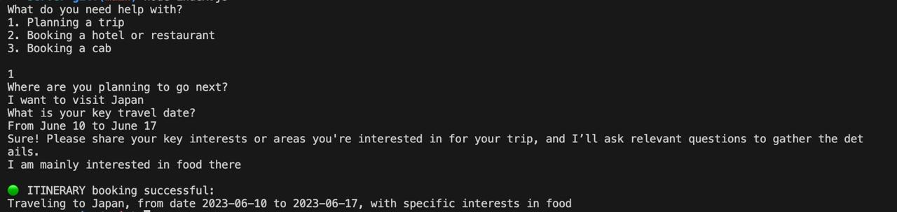
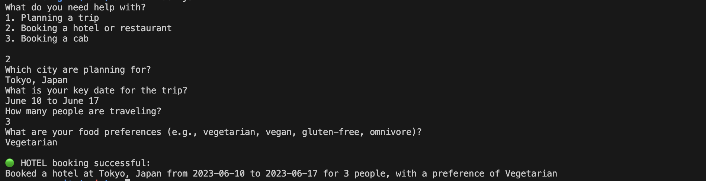
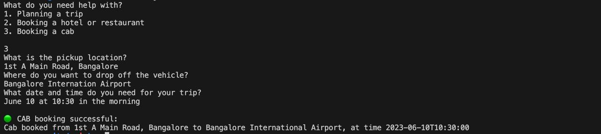

# Pre-requisite Collection & Booking System

## Steps to run the system

To run the local express server, in the `server` directory run:

### `node server.js`

In the same directory, to start the system in CLI, run:

### `node index.js`

## Design decisions

1. The first agent `customerAgent.js`, is a separate class, responsible for handling the flow of questions
2. The second agent `apiAgent.js`, is responsible for handling the external API calls
3. The third agent `statusAgent.js`, is responsible for handling the status after each call

4. Each of these agents communicate with each other using event emitters, simulating asynchronuous message transfer.
5. Using ChatGPT APIs to dynamically generate questions for each service type
6. Created real HTTP endpoints to simulate API calls
7. Single entry and control point

## Assumptions made

1. One service request per session
2. No user authorization included
3. No API delays

## Simulated example conversations for all three use-cases.

#### Trip planning

```
What do you need help with?
1. Planning a trip
2. Booking a hotel or restaurant
3. Booking a cab

1
Where are you planning to go next?
I want to visit Japan
What is your key travel date?
From June 10 to June 17
Sure! Please share your key interests or areas you're interested in for your trip, and I’ll ask relevant questions to gather the details.
I am mainly interested in food there

🟢 ITINERARY booking successful:
Traveling to Japan, from date 2023-06-10 to 2023-06-17, with specific interests in food
```



#### Booking a hotel

```
What do you need help with?
1. Planning a trip
2. Booking a hotel or restaurant
3. Booking a cab

2
Which city are planning for?
Tokyo, Japan
What is your key date for the trip?
June 10 to June 17
How many people are traveling?
3
What are your food preferences (e.g., vegetarian, vegan, gluten-free, omnivore)?
Vegetarian

🟢 HOTEL booking successful:
Booked a hotel at Tokyo, Japan from 2023-06-10 to 2023-06-17 for 3 people, with a preference of Vegetarian
```



#### Booking a cab

```
What do you need help with?
1. Planning a trip
2. Booking a hotel or restaurant
3. Booking a cab

3
What is the pickup location?
1st A Main Road, Bangalore
Where do you want to drop off the vehicle?
Bangalore Internation Airport
What date and time do you need for your trip?
June 10 at 10:30 in the morning

🟢 CAB booking successful:
Cab booked from 1st A Main Road, Bangalore to Bangalore International Airport, at time 2023-06-10T10:30:00
```


